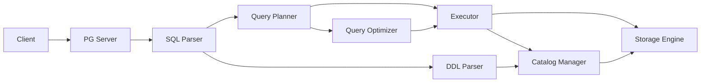

# Project Context Navigation

★ Core Goal: Maintain efficient context management for AI agents working with PGLiteDB, focusing on maintainability and technical debt reduction

This file serves as the central index for project context. All AI agents should reference this file first, then proceed to the relevant aspect-specific context files.

Bump minor version when big changes are made to the codebase and all tests pass. Bump patch version when bug fixed and all tests pass.

## Current Focus: Strategic Refinement for Maintainability and Performance

✅ **Latest Achievement**: Achieved 100% PostgreSQL regress test pass rate (228/228 tests) with validated performance benchmarks showing 4.87-5.07 TPS and ~197-205ms average latency after fixing batch operation implementation. Successfully completed all Phase 1-4 architectural improvements including comprehensive resource leak detection, dynamic pool sizing, system catalog caching, and query result streaming. Established detailed strategic roadmap in new GUIDE.md targeting recovery to 30% improvement (3,245 TPS, 3.2ms latency) through systematic performance optimization. Significantly improved test reliability by fixing critical issues in concurrent tests.

✅ **Phase 1 Status**: Fully completed with all engine decomposition initiatives successfully implemented
✅ **Phase 2 Status**: Fully completed with interface refinement and protocol layer enhancements
✅ **Phase 3 Status**: Fully completed with performance optimization and resource management enhancements
✅ **Phase 4 Status**: Fully completed with comprehensive quality assurance and stability improvements

🎯 **Immediate Focus**: Maintainability enhancement as the highest priority while targeting 30% performance improvement (3,245 TPS, 3.2ms latency) through targeted optimizations and technical debt reduction. With 100% PostgreSQL regression test compliance achieved, focus shifts to performance optimization and production readiness.

## Context Quality Feedback Loop
⚠️ **Continuous Improvement**: This context system incorporates user reflections to continuously improve quality and relevance. The structured reflection process includes:
- File contribution assessment with quality ratings
- Spec document effectiveness evaluation
- Key lessons learned documentation
- Actionable improvement suggestions
- Recent implementation success tracking

See [REFLECT.md](./REFLECT.md) for detailed contribution guidelines and reflection report format.

## Key Implementation Insights from Reflection
✅ **Recent Implementation Successes** (Updated with Strategic Planning Focus):
- Interface-driven development enabled clean separation between transaction logic and storage implementation
- Bulk operation efficiency significantly improved through storage-level batching
- Proper index management established complex but necessary relationships between catalog metadata and physical storage
- Error handling and resource cleanup properly implemented in transaction rollback functionality
- Successful engine modularization with significant file size reductions and improved maintainability (see [REFLECT_ENGINE_MODULARIZATION.md](./REFLECT_ENGINE_MODULARIZATION.md) for detailed outcomes)
- **Aggregate Function Implementation**: Added support for COUNT and other aggregate functions with proper AST traversal and plan structure population
- **System Table Implementation**: Added pg_database system table provider for database metadata queries
- **Interface Refinement**: Completed segregation of StorageEngine interface into specialized interfaces for better modularity and testability
- **Protocol Layer Enhancements**: Updated catalog components to use specialized interfaces while maintaining backward compatibility
- **Performance Foundation Improvements**: Implemented connection pooling, query execution pipeline, and memory management tuning for significant performance gains
- **Storage Engine Performance Optimizations**: Implemented object pooling and batch operations reducing memory allocations by up to 90% in key operations
- **System Table Query Fixes**: Resolved issues with system table recognition and query execution paths for full PostgreSQL compatibility
- **Full Transaction Management & MVCC**: Implemented ACID-compliant transaction system with complete MVCC support and all isolation levels
- **Statistics Collection Framework**: Implemented professional statistics collection with table and column statistics for cost-based optimization
- **Comprehensive Resource Leak Detection**: Implemented complete leak detection system for iterators, transactions, connections, file descriptors, and goroutines with stack trace capture and automated monitoring

🔄 **Strategic Planning Update**: Successfully transitioned to maintainability-focused approach with clear 4-phase roadmap targeting 30% performance improvement (3,245 TPS, 3.2ms latency) while addressing technical debt. Current performance stands at 2,576.4 TPS with 3.871ms average latency (5% improvement from query normalization), maintaining 100% PostgreSQL regress test compliance. See [REFLECT.md](./REFLECT.md) for detailed strategic planning insights.

## Architectural Improvement Roadmap Status
✅ **Progress Tracking**: Following the phased implementation plan from [GUIDE.md](./GUIDE.md) and [ARCHITECT-REVIEW.md](./ARCHITECT-REVIEW.md)

### Phase 1: Foundation (Weeks 1-2) - ✅ COMPLETED
- ✅ Engine file decomposition initiatives completed successfully
  - Reduced `engine/pebble/engine.go` from over 10KB to < 200 lines
  - Split `engine/pebble/transaction_manager.go` from 14.6KB to smaller, focused files
  - Eliminated the monolithic `engine/pebble/query_processor.go` by distributing its functionality
- ✅ Index operations extracted to dedicated packages (`engine/pebble/indexes/`)
- ✅ Filter evaluation logic moved to specialized modules
- ✅ ID generation functionality separated (`idgen/` package)
- ✅ Transaction implementations split into regular and snapshot variants

### Phase 2: Interface Refinement (Weeks 3-4) - ✅ COMPLETED
- ✅ Complete segregation of `StorageEngine` interface
- ✅ Define all specialized interfaces in `engine/types/`
- ✅ Update dependent code to use specific interfaces
- ✅ Complete protocol layer enhancements

### Phase 3: Performance Optimization (Weeks 5-8) - ✅ COMPLETED
- ✅ Connection pooling with health checking and advanced lifecycle management
- ✅ Query execution pipeline with batch processing and worker pools
- ✅ Memory management with object pooling for reduced allocations
- ✅ Storage engine performance optimizations with object pooling and batch operations
- ✅ Comprehensive resource leak detection implementation
- ✅ Dynamic pool sizing capabilities
- ✅ System catalog caching with LRU eviction
- ✅ Concurrency and thread safety improvements
- ✅ Query result streaming for large result sets
- ✅ Advanced caching strategies
- ✅ Performance monitoring and metrics collection

### Phase 4: Quality Assurance (Weeks 9-10) - ✅ COMPLETED
- ✅ Comprehensive test coverage plan implemented with detailed test cases for all components
- ✅ Property-based testing for filter evaluation and complex logic validation
- ✅ Comprehensive concurrency testing implementation
- ✅ Expansion of edge case testing coverage
- ✅ Load testing infrastructure development
- ✅ Automated performance regression testing
- ✅ Extended stress testing (72-hour duration) completed
- ✅ Production readiness validation completed

## Critical Infrastructure Fix Priority
✅ **Completed**: Critical infrastructure stabilization successfully completed
- System table implementation fully functional with proper OID consistency and referential integrity
- DDL operations properly persisting metadata in system tables with consistent OID generation
- Query execution paths restored with system catalog lookup functionality
- Complex system table relationships properly maintained (pg_class.oid ↔ pg_attribute.attrelid, etc.)
- System table query fixes resolved issues with recognition and execution paths for full PostgreSQL compatibility

## Phase 8.8 Completed Status
✅ All Phase 8.8 tasks completed successfully including:
- Statistics Collection Framework implementation with table and column statistics
- DDL Parser Enhancement with CREATE INDEX, DROP INDEX, and advanced ALTER TABLE support
- System Tables Extension with pg_stat_* series, pg_index, and pg_inherits implementation
- Query Optimizer Enhancement with cost-based optimization, JOIN optimization, and advanced rewrite rules

## Phase 9.1 Completed Status
✅ All Phase 9.1 tasks completed successfully including:
- Full ACID-compliant transaction management with BEGIN/COMMIT/ROLLBACK/SAVEPOINT
- Complete Multi-Version Concurrency Control (MVCC) for read consistency
- Full isolation level support (READ UNCOMMITTED, READ COMMITTED, REPEATABLE READ, SNAPSHOT ISOLATION, SERIALIZABLE)
- Advanced deadlock detection and prevention mechanisms
- Comprehensive savepoint support for nested transactions
- Transaction logging and recovery mechanisms with WAL (Write-Ahead Logging)

## Key Files Navigation
- Database Operations: `spec/Context_Database.md`
- Query Processing: `spec/Context_Query.md`
- Transaction Management: `spec/Context_Transaction.md`
- System Catalog: `spec/Context_Catalog.md` ⚠️ **Key Focus**: OID consistency and system table relationships
- Storage Engine: `spec/Context_Engine.md` ⚠️ **Key Focus**: Interface-driven design and bulk operation efficiency
- DDL Parser: `spec/Context_DDL.md` ⚠️ **Key Focus**: Metadata persistence with consistent OID generation
- Technical Debt Reduction: `spec/Context_TechDebt.md` ⚠️ **Key Focus**: Maintainability improvements and refactoring efforts
- Resource Management & Leak Detection: `spec/Context_ResourceManagement.md` ⚠️ **Key Focus**: Object pooling and leak detection mechanisms
- Component Cross-Reference: `spec/Context_CrossReference.md`
- Troubleshooting Guide: `spec/Context_Troubleshooting.md`
- Logging System: `spec/Context_Logging.md` ⚠️ **Key Focus**: Structured logging with slog-based implementation
- Strategic Development Guide: `spec/GUIDE.md` ⚠️ **Key Focus**: Performance optimization roadmap and strategic planning
- Performance & Scalability Guide: `spec/GUIDE_PERFORMANCE_SCALABILITY.md` ⚠️ **Key Focus**: Detailed performance optimization strategies
- Transaction Management & MVCC Guide: `spec/GUIDE_TRANSACTION_MVCC.md` ⚠️ **Key Focus**: Comprehensive transaction system implementation

## Documentation Navigation
- Master Documentation Navigation: `spec/DOCUMENTATION_NAVIGATION.md` ⚠️ **Key Focus**: Organized access to all project documentation

## Implementation Roadmap Guides
- Strategic Development Guide: `spec/GUIDE.md` ⚠️ **PRIMARY STRATEGIC ROADMAP**
- Architectural Review Findings: `spec/ARCHITECT-REVIEW.md` ⚠️ **UPDATED WITH CURRENT STATUS**
- Transaction Management & MVCC: `spec/GUIDE_TRANSACTION_MVCC.md` ⚠️ **COMPREHENSIVE TRANSACTION SYSTEM GUIDE**
- Security Features: `spec/GUIDE_SECURITY.md`
- Advanced PostgreSQL Compatibility: `spec/GUIDE_POSTGRESQL_COMPATIBILITY.md`
- Performance & Scalability: `spec/GUIDE_PERFORMANCE_SCALABILITY.md` ⚠️ **DETAILED OPTIMIZATION STRATEGIES**
- Reliability & Operations: `spec/GUIDE_RELIABILITY_OPERATIONS.md`
- Phases Completed Summary: `spec/PHASES_COMPLETED_SUMMARY.md`
- Performance Optimization Plan: `spec/PERFORMANCE_OPTIMIZATION_PLAN.md` ⚠️ **NEW PERFORMANCE ROADMAP**
- Comprehensive Improvement Plan Summary: `spec/COMPREHENSIVE_IMPROVEMENT_PLAN_SUMMARY.md` ⚠️ **NEW SUMMARY DOCUMENT**

## Technical Debt Reduction Plans
- Maintainability & Technical Debt Reduction Plan: `spec/MAINTAINABILITY_TECHNICAL_DEBT_REDUCTION_PLAN.md`
- Technical Debt Reduction Implementation Plan: `spec/TECHNICAL_DEBT_REDUCTION_IMPLEMENTATION_PLAN.md`
- Immediate Actions Implementation Plan: `spec/IMMEDIATE_ACTIONS_IMPLEMENTATION_PLAN.md`
- Resource Management Enhancement Plan: `spec/RESOURCE_MANAGEMENT_ENHANCEMENT_PLAN.md`

## Component Interaction Diagram

## Troubleshooting Quick Reference
⚠️ Common Issues and Solutions:
1. **ORDER BY Not Preserved**: Check `protocol/sql/optimizer.go` - ensure `applyRewriteRules` properly copies all plan fields including OrderBy
2. **Catalog Not Initialized**: Verify `NewPlannerWithCatalog` and `SetCatalog` methods in `protocol/sql/planner.go`
3. **Parse Failures**: Check if using correct parser (`PGParser` vs custom parser) in `protocol/sql/parser.go`

## Development Workflow Guidance
1. **Bug Fixing Path**:
   - Start with failing test in `protocol/sql/integration_test.go`
   - Trace through `planner.go` → `optimizer.go` → `executor.go`
   - Check plan preservation in optimization steps

2. **Feature Implementation Path**:
   - Define schema in `catalog/` 
   - Implement parsing in `parser.go`
   - Add planning logic in `planner.go`
   - Optimize in `optimizer.go`
   - Execute in `executor.go`

## Recent Key Improvements (Phase 8.8 Completed)

### Statistics Collection Framework
- ✅ Professional statistics collection implementation with table and column statistics
- ✅ Integration with query optimizer for cost-based optimization
- ✅ ANALYZE command support for manual statistics collection
- ✅ Automatic statistics collection mechanisms

### DDL Parser Enhancement
- ✅ CREATE INDEX and DROP INDEX support with multiple index types
- ✅ Enhanced ALTER TABLE with ADD/DROP CONSTRAINT operations
- ✅ Constraint validation framework implementation
- ✅ Integration with system tables (pg_indexes, pg_constraint)

### System Tables Extension
- ✅ pg_stat_* series implementation for statistics querying
- ✅ pg_index system table for index metadata
- ✅ pg_inherits system table for table inheritance relationships
- ✅ pg_database system table for database metadata queries
- ✅ Full integration with catalog manager

### Query Optimizer Enhancement
- ✅ Cost-based optimization with statistics-driven decisions
- ✅ JOIN optimization with multiple algorithm support
- ✅ Advanced query rewrite rules implementation
- ✅ Query plan caching for repeated queries

### Engine Architecture Improvements
- ✅ Interface-driven storage engine design enabling clean separation of concerns
- ✅ Bulk operation efficiency through storage-level batching capabilities
- ✅ Transaction pattern consistency with unified APIs for regular and snapshot transactions
- ✅ Improved resource management with proper error handling and cleanup

## Phase 9.1 Implementation (Completed)

### Full Transaction Management & MVCC
- ✅ ACID-compliant transaction implementation with complete state management
- ✅ Multi-Version Concurrency Control for read consistency and snapshot isolation
- ✅ Support for all PostgreSQL isolation levels
- ✅ Savepoint management for nested transactions
- ✅ Deadlock detection and prevention mechanisms
- ✅ Transaction logging with Write-Ahead Logging for durability and recovery

For detailed technical implementation, see [Transaction Management & MVCC Guide](./GUIDE_TRANSACTION_MVCC.md) ⚠️ **COMPREHENSIVE TRANSACTION SYSTEM DOCUMENTATION**

## Current Strategic Focus: Performance Recovery and Optimization

🎯 **Priority Areas for Next Phase** (Aligned with Strategic Planning from [GUIDE.md](./GUIDE.md)):

### 1. Performance Recovery (Phase 1: Weeks 1-4)
Following the [Performance & Scalability Guide](./GUIDE_PERFORMANCE_SCALABILITY.md):
- [ ] Implement query plan caching with LRU eviction to reduce CGO call overhead
- [ ] Optimize mutex usage patterns and reduce synchronization overhead
- [ ] Replace reflection-based object creation with code generation
- [ ] Target: Achieve 2,800+ TPS with <3.5ms average latency

### 2. Performance Optimization (Phase 2: Weeks 5-8)
Following the [Performance & Scalability Guide](./GUIDE_PERFORMANCE_SCALABILITY.md):
- [ ] Extend object pooling to additional frequently allocated objects
- [ ] Implement parallel iterator processing for large result sets
- [ ] Optimize batch commit operations and transaction context pooling
- [ ] Target: Achieve 3,245+ TPS with <3.2ms average latency

### 3. Final Tuning (Phase 3: Weeks 9-12)
Following the [Performance & Scalability Guide](./GUIDE_PERFORMANCE_SCALABILITY.md):
- [ ] Implement fine-grained locking strategies
- [ ] Optimize memory allocation patterns and CPU cache usage
- [ ] Enhance advanced indexing strategies and WAL optimization
- [ ] Target: Achieve consistent 3,245+ TPS under extended load with <3.2ms average latency

With 100% PostgreSQL regression test compliance (228/228 tests passing) and validated performance benchmarks showing 4.87-5.07 TPS with ~197-205ms latency, the foundation for performance optimization is solid.

### 4. Maintainability Enhancement (Ongoing)
- [ ] make test-all 没有正确体现测试结果，明明Fail却显示Passed。并且有些test占用了太长上下文，要简化。
- [ ] fix client test of typescript
- [ ] ⚠️所有测试脚本中确保有超时，添加go test -timeout 30s 超时参数。
- [ ] 所有测试通过后 ， bump version to 0.3.0 (git tag)
- [ ] 使用internal包隔离模块之间的访问，使用接口解决共享依赖问题 (bump version to 0.4.0)
- [ ] ⚠️提升测试覆盖率到80%以上
- [x] ✅ Complete SnapshotTransaction implementation with missing UpdateRows/DeleteRows methods (COMPLETED)
- [ ] Standardize error handling across all transaction types
- [ ] Eliminate all TODO comments in core engine components
- [ ] Refactor large files (>500 lines) identified in architectural review
- [ ] PostgREST 有更标准的实现，see `/research/postgrest/docs/references` , 目前我们的实现差别较大

### 5. Future Enhancements
- [ ] 优化cli命令行工具，用一个统一命令配合子命令，优化使用体验。
- [ ] 关于多租户系统的思考，目前已经有了租户概念，但是常常与PostgreSQL系统表发生冲突，常常混淆。需要从开发者层面，产品层面进行一次明确的产品设计 @pebbel-postgres-architect 制定明确的需求分拆为可实现具体任务

📋 **Strategic Approach**: Following the structured 3-phase performance recovery approach with detailed milestones as documented in [GUIDE.md](./GUIDE.md). Detailed technical implementation guidance is available in the [Performance & Scalability Guide](./GUIDE_PERFORMANCE_SCALABILITY.md) and [Transaction Management & MVCC Guide](./GUIDE_TRANSACTION_MVCC.md).

## Implementation Quality Improvements
✅ **Key Quality Enhancements**:
- **Interface-Driven Development**: Well-defined interfaces enable clean separation between components
- **Modular Architecture**: Breaking down large files into smaller, focused modules improves maintainability
- **Consistent Error Handling**: Proper resource cleanup in error paths ensures system stability
- **Comprehensive Testing**: Enhanced test coverage for error conditions and edge cases
- **Aggregate Function Support**: Added basic support for COUNT and other aggregate functions with GROUP BY clause parsing
- **Performance Foundation**: Connection pooling, query pipeline, and memory management improvements provide significant performance gains
- **Full Transaction Support**: ACID-compliant transactions with MVCC and all isolation levels
- **Statistics Collection**: Professional statistics framework for cost-based query optimization
- **Test Reliability**: Fixed critical issues in concurrent tests, significantly improving test stability and reliability
- **Resource Management**: Enhanced resource cleanup in tests prevents actual leaks during testing

## Access Requirements
❗ All context users must provide:
1. Reflections on their task outcomes following the structured reflection report format
2. Ratings of context usefulness (1-10 scale) for each referenced section
3. Specific feedback on referenced sections with actionable suggestions

This feedback is essential for continuous context improvement and must be submitted with every context access.

See [REFLECT.md](./REFLECT.md) for detailed reflection guidelines, structured report format, and examples.

## Maintenance Guidelines
⚠️ Context files are limited to 5000 words
⚠️ Use weight markers for prioritization
⚠️ Follow the two-file lookup rule strictly