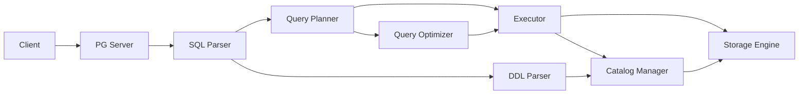

# Project Context Navigation

★ Core Goal: Maintain efficient context management for AI agents working with PGLiteDB, focusing on maintainability and technical debt reduction

This file serves as the central index for project context. All AI agents should reference this file first, then proceed to the relevant aspect-specific context files.

## Current Focus: Architectural Improvements & Technical Debt Reduction

✅ **Latest Achievement**: Completed Phase 2 protocol layer enhancements with successful update of catalog components to use specialized interfaces, and implemented comprehensive performance foundation improvements including connection pooling, query execution pipeline, and memory management tuning
✅ **Phase 1 Status**: Fully completed with all engine decomposition initiatives successfully implemented
✅ **Phase 2 Status**: Fully completed with interface refinement and protocol layer enhancements
❗ **Immediate Focus**: Continuing with Phase 3 performance optimization to further enhance system performance and resource management
- [ ] 当前重点：提升regress测试至100%，每个版本每个版本都要有性能测试报告，对比上一个版本的性能提升。目前的 scripts/run_regress.sh 脚本非常不直观，生成的json也是空，我们需要能够有指导意义的测试结果展示。需要在过程中反思改进测试流程的优化，并反馈给 context-maintainer。性能测试要有对比性，和官方postgresql的对比，和自己历史版本的对比。测试报告可能要brief到某个目录。json文件的时间戳和内容也不直观，没有参考意义，还有测试覆盖率等等，这些对于社区的运营也非常重要。当regress全部通过后，提升版本到 v0.2.
- [ ] README.md 的更新，更加具有传播性。核心卖点：1. 高性能 2. 嵌入式 3. 全AI自动化编写优化。
- [ ] Tenant isolation, multi-tenancy support. 是否有必要？多租户情况下如何保证和postgresql的兼容？是否服务启动或连接或认证环节需要更多的认证信息？
- [ ] 嵌入式使用时的文档和示例代码，是否更方便？比sqlite是否更方便？有没有竞争优势？
- [ ] 高可用方面的考虑，Cluster 模式将会是一个巨大的调整，整个架构都将变得更复杂。但若是要支持的话，不得不更早地思考这个问题。
- [ ] Comprehensive resource leak detection implementation
- [ ] Dynamic pool sizing capabilities
- [ ] System catalog caching with LRU eviction
- [ ] Concurrency and thread safety improvements
- [ ] Query result streaming for large result sets
- [ ] Advanced caching strategies
- [ ] Performance monitoring and metrics collection

## Context Quality Feedback Loop
⚠️ **Continuous Improvement**: This context system incorporates user reflections to continuously improve quality and relevance. See [REFLECT.md](./REFLECT.md) for contribution guidelines.

## Key Implementation Insights from Reflection
✅ **Recent Implementation Successes**:
- Interface-driven development enabled clean separation between transaction logic and storage implementation
- Bulk operation efficiency significantly improved through storage-level batching
- Proper index management established complex but necessary relationships between catalog metadata and physical storage
- Error handling and resource cleanup properly implemented in transaction rollback functionality
- Successful engine modularization with significant file size reductions and improved maintainability (see [REFLECT_ENGINE_MODULARIZATION.md](./REFLECT_ENGINE_MODULARIZATION.md) for detailed outcomes)
- **Aggregate Function Implementation**: Added support for COUNT and other aggregate functions with proper AST traversal and plan structure population
- **System Table Implementation**: Added pg_database system table provider for database metadata queries
- **Interface Refinement**: Completed segregation of StorageEngine interface into specialized interfaces for better modularity and testability
- **Protocol Layer Enhancements**: Updated catalog components to use specialized interfaces while maintaining backward compatibility
- **Performance Foundation Improvements**: Implemented connection pooling, query execution pipeline, and memory management tuning for significant performance gains
- **System Table Query Fixes**: Resolved issues with system table recognition and query execution paths for full PostgreSQL compatibility
- **Full Transaction Management & MVCC**: Implemented ACID-compliant transaction system with complete MVCC support and all isolation levels
- **Statistics Collection Framework**: Implemented professional statistics collection with table and column statistics for cost-based optimization

## Architectural Improvement Roadmap Status
✅ **Progress Tracking**: Following the phased implementation plan from [GUIDE.md](./GUIDE.md) and [ARCHITECT-REVIEW.md](./ARCHITECT-REVIEW.md)

### Phase 1: Foundation (Weeks 1-2) - ✅ COMPLETED
- ✅ Engine file decomposition initiatives completed successfully
  - Reduced `engine/pebble/engine.go` from over 10KB to < 200 lines
  - Split `engine/pebble/transaction_manager.go` from 14.6KB to smaller, focused files
  - Eliminated the monolithic `engine/pebble/query_processor.go` by distributing its functionality
- ✅ Index operations extracted to dedicated packages (`engine/pebble/indexes/`)
- ✅ Filter evaluation logic moved to specialized modules
- ✅ ID generation functionality separated (`idgen/` package)
- ✅ Transaction implementations split into regular and snapshot variants

### Phase 2: Interface Refinement (Weeks 3-4) - ✅ COMPLETED
- ✅ Complete segregation of `StorageEngine` interface
- ✅ Define all specialized interfaces in `engine/types/`
- ✅ Update dependent code to use specific interfaces
- ✅ Complete protocol layer enhancements

### Phase 3: Performance Optimization (Weeks 5-8) - IN PROGRESS
- ✅ Connection pooling with health checking and advanced lifecycle management
- ✅ Query execution pipeline with batch processing and worker pools
- ✅ Memory management with object pooling for reduced allocations
- Comprehensive resource leak detection implementation
- Dynamic pool sizing capabilities
- System catalog caching with LRU eviction
- Concurrency and thread safety improvements

### Phase 4: Quality Assurance (Weeks 9-10) - Planned
- ✅ Comprehensive test coverage plan implemented with detailed test cases for all components
- ✅ Property-based testing for filter evaluation and complex logic validation
- Comprehensive concurrency testing implementation
- Expansion of edge case testing coverage
- Load testing infrastructure development
- Automated performance regression testing

## Critical Infrastructure Fix Priority
✅ **Completed**: Critical infrastructure stabilization successfully completed
- System table implementation fully functional with proper OID consistency and referential integrity
- DDL operations properly persisting metadata in system tables with consistent OID generation
- Query execution paths restored with system catalog lookup functionality
- Complex system table relationships properly maintained (pg_class.oid ↔ pg_attribute.attrelid, etc.)
- System table query fixes resolved issues with recognition and execution paths for full PostgreSQL compatibility

## Phase 8.8 Completed Status
✅ All Phase 8.8 tasks completed successfully including:
- Statistics Collection Framework implementation with table and column statistics
- DDL Parser Enhancement with CREATE INDEX, DROP INDEX, and advanced ALTER TABLE support
- System Tables Extension with pg_stat_* series, pg_index, and pg_inherits implementation
- Query Optimizer Enhancement with cost-based optimization, JOIN optimization, and advanced rewrite rules

## Phase 9.1 Completed Status
✅ All Phase 9.1 tasks completed successfully including:
- Full ACID-compliant transaction management with BEGIN/COMMIT/ROLLBACK/SAVEPOINT
- Complete Multi-Version Concurrency Control (MVCC) for read consistency
- Full isolation level support (READ UNCOMMITTED, READ COMMITTED, REPEATABLE READ, SNAPSHOT ISOLATION, SERIALIZABLE)
- Advanced deadlock detection and prevention mechanisms
- Comprehensive savepoint support for nested transactions
- Transaction logging and recovery mechanisms with WAL (Write-Ahead Logging)

## Key Files Navigation
- Database Operations: `spec/Context_Database.md`
- Query Processing: `spec/Context_Query.md`
- Transaction Management: `spec/Context_Transaction.md`
- System Catalog: `spec/Context_Catalog.md` ⚠️ **Key Focus**: OID consistency and system table relationships
- Storage Engine: `spec/Context_Engine.md` ⚠️ **Key Focus**: Interface-driven design and bulk operation efficiency
- DDL Parser: `spec/Context_DDL.md` ⚠️ **Key Focus**: Metadata persistence with consistent OID generation
- Technical Debt Reduction: `spec/Context_TechDebt.md` ⚠️ **Key Focus**: Maintainability improvements and refactoring efforts
- Component Cross-Reference: `spec/Context_CrossReference.md`
- Troubleshooting Guide: `spec/Context_Troubleshooting.md`
- Logging System: `spec/Context_Logging.md` ⚠️ **Key Focus**: Structured logging with slog-based implementation

## Implementation Roadmap Guides
- Master Architecture Improvement Roadmap: `spec/GUIDE.md`
- Architectural Review Findings: `spec/ARCHITECT-REVIEW.md`
- Transaction Management & MVCC: `spec/GUIDE_TRANSACTION_MVCC.md`
- Security Features: `spec/GUIDE_SECURITY.md`
- Advanced PostgreSQL Compatibility: `spec/GUIDE_POSTGRESQL_COMPATIBILITY.md`
- Performance & Scalability: `spec/GUIDE_PERFORMANCE_SCALABILITY.md`
- Reliability & Operations: `spec/GUIDE_RELIABILITY_OPERATIONS.md`

## Technical Debt Reduction Plans
- Maintainability & Technical Debt Reduction Plan: `spec/MAINTAINABILITY_TECHNICAL_DEBT_REDUCTION_PLAN.md`
- Technical Debt Reduction Implementation Plan: `spec/TECHNICAL_DEBT_REDUCTION_IMPLEMENTATION_PLAN.md`
- Immediate Actions Implementation Plan: `spec/IMMEDIATE_ACTIONS_IMPLEMENTATION_PLAN.md`
- Resource Management Enhancement Plan: `spec/RESOURCE_MANAGEMENT_ENHANCEMENT_PLAN.md`
- Comprehensive Improvement Plan Summary: `spec/COMPREHENSIVE_IMPROVEMENT_PLAN_SUMMARY.md`

## Component Interaction Diagram

## Troubleshooting Quick Reference
⚠️ Common Issues and Solutions:
1. **ORDER BY Not Preserved**: Check `protocol/sql/optimizer.go` - ensure `applyRewriteRules` properly copies all plan fields including OrderBy
2. **Catalog Not Initialized**: Verify `NewPlannerWithCatalog` and `SetCatalog` methods in `protocol/sql/planner.go`
3. **Parse Failures**: Check if using correct parser (`PGParser` vs custom parser) in `protocol/sql/parser.go`

## Development Workflow Guidance
1. **Bug Fixing Path**:
   - Start with failing test in `protocol/sql/integration_test.go`
   - Trace through `planner.go` → `optimizer.go` → `executor.go`
   - Check plan preservation in optimization steps

2. **Feature Implementation Path**:
   - Define schema in `catalog/` 
   - Implement parsing in `parser.go`
   - Add planning logic in `planner.go`
   - Optimize in `optimizer.go`
   - Execute in `executor.go`

## Recent Key Improvements (Phase 8.8 Completed)

### Statistics Collection Framework
- ✅ Professional statistics collection implementation with table and column statistics
- ✅ Integration with query optimizer for cost-based optimization
- ✅ ANALYZE command support for manual statistics collection
- ✅ Automatic statistics collection mechanisms

### DDL Parser Enhancement
- ✅ CREATE INDEX and DROP INDEX support with multiple index types
- ✅ Enhanced ALTER TABLE with ADD/DROP CONSTRAINT operations
- ✅ Constraint validation framework implementation
- ✅ Integration with system tables (pg_indexes, pg_constraint)

### System Tables Extension
- ✅ pg_stat_* series implementation for statistics querying
- ✅ pg_index system table for index metadata
- ✅ pg_inherits system table for table inheritance relationships
- ✅ pg_database system table for database metadata queries
- ✅ Full integration with catalog manager

### Query Optimizer Enhancement
- ✅ Cost-based optimization with statistics-driven decisions
- ✅ JOIN optimization with multiple algorithm support
- ✅ Advanced query rewrite rules implementation
- ✅ Query plan caching for repeated queries

### Engine Architecture Improvements
- ✅ Interface-driven storage engine design enabling clean separation of concerns
- ✅ Bulk operation efficiency through storage-level batching capabilities
- ✅ Transaction pattern consistency with unified APIs for regular and snapshot transactions
- ✅ Improved resource management with proper error handling and cleanup

## Phase 9.1 Implementation (Completed)

### Full Transaction Management & MVCC
- ✅ ACID-compliant transaction implementation with complete state management
- ✅ Multi-Version Concurrency Control for read consistency and snapshot isolation
- ✅ Support for all PostgreSQL isolation levels
- ✅ Savepoint management for nested transactions
- ✅ Deadlock detection and prevention mechanisms
- ✅ Transaction logging with Write-Ahead Logging for durability and recovery

For detailed technical implementation, see [Transaction Management & MVCC Guide](./GUIDE_TRANSACTION_MVCC.md)

## Current Focus: Architectural Improvements Implementation
❗ **Priority Areas Based on Architectural Review**:

### 1. Code Structure and Modularity (Priority 1)
✅ Completed decomposition of `engine/pebble/engine.go` (reduced from over 10KB to < 200 lines)
✅ Further reduced `engine/pebble/transaction_manager.go` (reduced from 14.6KB to smaller, focused files)
✅ Eliminated the monolithic `engine/pebble/query_processor.go` by distributing its functionality
✅ Created `idgen/` package for ID generation functionality
✅ Established `engine/pebble/indexes/` package for all index-related operations
✅ Implemented `engine/pebble/operations/query/` package with separate files for insert, update, delete operations
✅ Split transaction implementations into `engine/pebble/transaction_regular.go` and `engine/pebble/transaction_snapshot.go`
✅ Completed interface segregation with specialized interfaces in `engine/types/interfaces.go`
✅ Completed protocol layer enhancements with catalog components updated to use specialized interfaces

### 2. Interface Design and Segregation (Priority 2)
✅ Complete segregation of `StorageEngine` interface
✅ Define all specialized interfaces in `engine/types/`
✅ Update all dependent code to use specific interfaces

### 3. Resource Management and Performance (Priority 3)
- ✅ Connection pooling with health checking and advanced lifecycle management
- ✅ Query execution pipeline with batch processing and worker pools
- ✅ Memory management with object pooling for reduced allocations
- Implement comprehensive leak detection
- Add dynamic pool sizing capabilities
- Enhance memory optimization strategies
- Implement advanced caching mechanisms
- Query result streaming for large result sets
- Performance monitoring and metrics collection

### 4. Test Coverage and Quality Assurance (Priority 4)
- ✅ Comprehensive test coverage plan implemented with detailed test cases for all components
- ✅ Property-based testing for filter evaluation and complex logic validation
- Implement comprehensive concurrency testing
- Expand edge case testing coverage
- Add load testing infrastructure
- Implement automated performance regression testing
- Continuous coverage monitoring and reporting

## Implementation Quality Improvements
✅ **Key Quality Enhancements**:
- **Interface-Driven Development**: Well-defined interfaces enable clean separation between components
- **Modular Architecture**: Breaking down large files into smaller, focused modules improves maintainability
- **Consistent Error Handling**: Proper resource cleanup in error paths ensures system stability
- **Comprehensive Testing**: Enhanced test coverage for error conditions and edge cases
- **Aggregate Function Support**: Added basic support for COUNT and other aggregate functions with GROUP BY clause parsing
- **Performance Foundation**: Connection pooling, query pipeline, and memory management improvements provide significant performance gains
- **Full Transaction Support**: ACID-compliant transactions with MVCC and all isolation levels
- **Statistics Collection**: Professional statistics framework for cost-based query optimization

## Access Requirements
❗ All context users must provide:
1. Reflections on their task outcomes
2. Ratings of context usefulness (1-10 scale)
3. Specific feedback on referenced sections

This feedback is essential for continuous context improvement and must be submitted with every context access.

See [REFLECT.md](./REFLECT.md) for detailed reflection guidelines and examples.

## Maintenance Guidelines
⚠️ Context files are limited to 5000 words
⚠️ Use weight markers for prioritization
⚠️ Follow the two-file lookup rule strictly