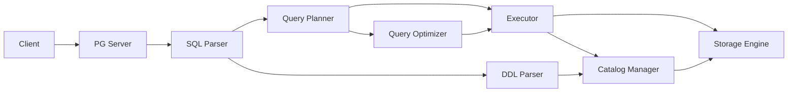

# Project Context Navigation

★ Core Goal: Maintain efficient context management for AI agents working with PGliteDB, focusing on maintainability and technical debt reduction

This file serves as the central index for project context. All AI agents should reference this file first, then proceed to the relevant aspect-specific context files.

## Current Focus: Maintainability & Technical Debt Reduction
❗ **Immediate Focus**: Code quality improvements and structural refactoring to address architectural review findings
- Large file decomposition (catalog/system_tables.go, engine/pebble_engine.go)
- Package structure improvements for better modularity
- Resource management enhancements (connection pooling, lifecycle management)
- Performance optimizations (caching, indexing)
- Concurrency and thread safety fixes

## Context Quality Feedback Loop
⚠️ **Continuous Improvement**: This context system incorporates user reflections to continuously improve quality and relevance. See [REFLECT.md](./REFLECT.md) for contribution guidelines.

## Key Implementation Insights from Reflection
✅ **Recent Implementation Successes**:
- Interface-driven development enabled clean separation between transaction logic and storage implementation
- Bulk operation efficiency significantly improved through storage-level batching
- Proper index management established complex but necessary relationships between catalog metadata and physical storage
- Error handling and resource cleanup properly implemented in transaction rollback functionality

## Maintainability Focus Updates
✅ **Technical Debt Reduction Progress**:
- Engine file decomposition initiatives underway to address monolithic components
- Code duplication elimination efforts in progress
- Incomplete implementations being completed (TODO resolution)
- Concurrency and thread safety improvements being implemented

## Critical Infrastructure Fix Priority
✅ **Completed**: Critical infrastructure stabilization successfully completed
- System table implementation fully functional with proper OID consistency and referential integrity
- DDL operations properly persisting metadata in system tables with consistent OID generation
- Query execution paths restored with system catalog lookup functionality
- Complex system table relationships properly maintained (pg_class.oid ↔ pg_attribute.attrelid, etc.)

## Current Focus: Maintainability & Technical Debt Reduction
❗ **Immediate Focus**: Code quality improvements and structural refactoring to address architectural review findings
- Large file decomposition (catalog/system_tables.go, engine/pebble_engine.go)
- Package structure improvements for better modularity
- Resource management enhancements (connection pooling, lifecycle management)
- Performance optimizations (caching, indexing)
- Concurrency and thread safety fixes

## Recent Fixes Status
✅ **Completed**: Critical infrastructure stabilization successfully completed
- System table implementation fully functional with proper OID consistency and referential integrity
- DDL operations properly persisting metadata in system tables with consistent OID generation
- Query execution paths restored with system catalog lookup functionality
- Complex system table relationships properly maintained (pg_class.oid ↔ pg_attribute.attrelid, etc.)
- See validation reports in [SYSTEM_TABLE_FIXES_VALIDATION.md](./SYSTEM_TABLE_FIXES_VALIDATION.md) and [TEST_LOG.md](./TEST_LOG.md)

## Phase 8.8 Completed Status
✅ All Phase 8.8 tasks completed successfully including:
- Statistics Collection Framework implementation with table and column statistics
- DDL Parser Enhancement with CREATE INDEX, DROP INDEX, and advanced ALTER TABLE support
- System Tables Extension with pg_stat_* series, pg_index, and pg_inherits implementation
- Query Optimizer Enhancement with cost-based optimization, JOIN optimization, and advanced rewrite rules

## Phase 9.1 Completed Status
✅ All Phase 9.1 tasks completed successfully including:
- Full ACID-compliant transaction management with BEGIN/COMMIT/ROLLBACK/SAVEPOINT
- Complete Multi-Version Concurrency Control (MVCC) for read consistency
- Full isolation level support (READ UNCOMMITTED, READ COMMITTED, REPEATABLE READ, SNAPSHOT ISOLATION, SERIALIZABLE)
- Advanced deadlock detection and prevention mechanisms
- Comprehensive savepoint support for nested transactions
- Transaction logging and recovery mechanisms with WAL (Write-Ahead Logging)

## Key Files Navigation
- Database Operations: `spec/Context_Database.md`
- Query Processing: `spec/Context_Query.md`
- Transaction Management: `spec/Context_Transaction.md`
- System Catalog: `spec/Context_Catalog.md` ⚠️ **Key Focus**: OID consistency and system table relationships
- Storage Engine: `spec/Context_Engine.md` ⚠️ **Key Focus**: Interface-driven design and bulk operation efficiency
- DDL Parser: `spec/Context_DDL.md` ⚠️ **Key Focus**: Metadata persistence with consistent OID generation
- Technical Debt Reduction: `spec/Context_TechDebt.md` ⚠️ **Key Focus**: Maintainability improvements and refactoring efforts
- Component Cross-Reference: `spec/Context_CrossReference.md`
- Troubleshooting Guide: `spec/Context_Troubleshooting.md`
- Logging System: `spec/Context_Logging.md` ⚠️ **Key Focus**: Structured logging with slog-based implementation

## Phase 9.0 Implementation Guides
- Master Implementation Plan: `spec/GUIDE.md`
- Transaction Management & MVCC: `spec/GUIDE_TRANSACTION_MVCC.md`
- Security Features: `spec/GUIDE_SECURITY.md`
- Advanced PostgreSQL Compatibility: `spec/GUIDE_POSTGRESQL_COMPATIBILITY.md`
- Performance & Scalability: `spec/GUIDE_PERFORMANCE_SCALABILITY.md`
- Reliability & Operations: `spec/GUIDE_RELIABILITY_OPERATIONS.md`

## Technical Debt Reduction Plans
- Maintainability & Technical Debt Reduction Plan: `spec/MAINTAINABILITY_TECHNICAL_DEBT_REDUCTION_PLAN.md`
- Technical Debt Reduction Implementation Plan: `spec/TECHNICAL_DEBT_REDUCTION_IMPLEMENTATION_PLAN.md`
- Immediate Actions Implementation Plan: `spec/IMMEDIATE_ACTIONS_IMPLEMENTATION_PLAN.md`
- Resource Management Enhancement Plan: `spec/RESOURCE_MANAGEMENT_ENHANCEMENT_PLAN.md`
- Comprehensive Improvement Plan Summary: `spec/COMPREHENSIVE_IMPROVEMENT_PLAN_SUMMARY.md`

## Component Interaction Diagram

## Troubleshooting Quick Reference
⚠️ Common Issues and Solutions:

1. **ORDER BY Not Preserved**: Check `protocol/sql/optimizer.go` - ensure `applyRewriteRules` properly copies all plan fields including OrderBy
2. **Catalog Not Initialized**: Verify `NewPlannerWithCatalog` and `SetCatalog` methods in `protocol/sql/planner.go`
3. **Parse Failures**: Check if using correct parser (`PGParser` vs custom parser) in `protocol/sql/parser.go`

## Development Workflow Guidance
1. **Bug Fixing Path**:
   - Start with failing test in `protocol/sql/integration_test.go`
   - Trace through `planner.go` → `optimizer.go` → `executor.go`
   - Check plan preservation in optimization steps

2. **Feature Implementation Path**:
   - Define schema in `catalog/` 
   - Implement parsing in `parser.go`
   - Add planning logic in `planner.go`
   - Optimize in `optimizer.go`
   - Execute in `executor.go`

## Recent Key Improvements (Phase 8.8 Completed)

### Statistics Collection Framework
- ✅ Professional statistics collection implementation with table and column statistics
- ✅ Integration with query optimizer for cost-based optimization
- ✅ ANALYZE command support for manual statistics collection
- ✅ Automatic statistics collection mechanisms

### DDL Parser Enhancement
- ✅ CREATE INDEX and DROP INDEX support with multiple index types
- ✅ Enhanced ALTER TABLE with ADD/DROP CONSTRAINT operations
- ✅ Constraint validation framework implementation
- ✅ Integration with system tables (pg_indexes, pg_constraint)

### System Tables Extension
- ✅ pg_stat_* series implementation for statistics querying
- ✅ pg_index system table for index metadata
- ✅ pg_inherits system table for table inheritance relationships
- ✅ Full integration with catalog manager

### Query Optimizer Enhancement
- ✅ Cost-based optimization with statistics-driven decisions
- ✅ JOIN optimization with multiple algorithm support
- ✅ Advanced query rewrite rules implementation
- ✅ Query plan caching for repeated queries

### Engine Architecture Improvements
- ✅ Interface-driven storage engine design enabling clean separation of concerns
- ✅ Bulk operation efficiency through storage-level batching capabilities
- ✅ Transaction pattern consistency with unified APIs for regular and snapshot transactions
- ✅ Improved resource management with proper error handling and cleanup

## Phase 9.1 Implementation (Completed)

### Full Transaction Management & MVCC
- ✅ ACID-compliant transaction implementation with complete state management
- ✅ Multi-Version Concurrency Control for read consistency and snapshot isolation
- ✅ Support for all PostgreSQL isolation levels
- ✅ Savepoint management for nested transactions
- ✅ Deadlock detection and prevention mechanisms
- ✅ Transaction logging with Write-Ahead Logging for durability and recovery

For detailed technical implementation, see [Transaction Management & MVCC Guide](./GUIDE_TRANSACTION_MVCC.md)

## Phase 9.0 Planning (In Progress)

### Critical Infrastructure Fix Priority
✅ **Completed**: Critical infrastructure stabilization successfully completed
- System table implementation fully functional with proper OID consistency and referential integrity
- DDL operations properly persisting metadata in system tables with consistent OID generation
- Query execution paths restored with system catalog lookup functionality

### Recent Improvements & Enhancements
✅ **Completed**: Key infrastructure improvements successfully implemented
- **Structured Logging System**: New slog-based logger with enhanced observability and context enrichment
- **Service Startup Monitoring**: Comprehensive logging for server initialization and connection handling
- **Executor Implementation**: Consolidated query execution with improved error handling and logging
- **Enhanced Observability**: Detailed timing and status information throughout the system

### Current Focus: Technical Debt Reduction
✅ **In Progress**: Maintainability improvements and refactoring efforts
- **Engine Decomposition**: Breaking down monolithic engine files into specialized components
- **Code Quality Improvements**: Eliminating duplication and completing placeholder implementations
- **Resource Management Enhancement**: Implementing comprehensive pooling and leak detection
- **Package Structure Refactoring**: Improving modularity and separation of concerns

### Current Focus: Maintainability & Technical Debt Reduction
❗ **Immediate Focus**: Code quality improvements and structural refactoring
- Large file decomposition (catalog/system_tables.go, engine/pebble_engine.go)
- Package structure improvements for better modularity
- Resource management enhancements (connection pooling, lifecycle management)
- Performance optimizations (caching, indexing)

### Core Implementation Areas (Post-Critical Fixes)
1. **Code Quality & Maintainability** - Refactor large files, improve package structure, reduce technical debt
   - Engine decomposition (Priority 1)
   - Code duplication elimination (Priority 1)
   - Incomplete implementations completion (Priority 1)
   - Concurrency fixes (Priority 1)
2. **Resource Management** - Implement connection pooling, timeout mechanisms, proper cleanup
   - Enhanced resource pooling (Priority 2)
   - Memory management optimization (Priority 2)
3. **Performance Optimization** - Add caching, optimize system table queries, improve scalability
   - System table caching (Priority 2)
   - Advanced concurrency patterns (Priority 3)
4. **Testability & Observability** - Enhance testing infrastructure, add monitoring and metrics
   - Test coverage enhancement (Priority 2)
   - Documentation and governance (Priority 3)
5. **Reliability & Operations** - Implement backup/restore, replication, and monitoring features
   - Package organization enhancement (Priority 2)
   - Interface segregation (Priority 2)

## Implementation Quality Improvements
✅ **Key Quality Enhancements**:
- **Interface-Driven Development**: Well-defined interfaces enable clean separation between components
- **Modular Architecture**: Breaking down large files into smaller, focused modules improves maintainability
- **Consistent Error Handling**: Proper resource cleanup in error paths ensures system stability
- **Comprehensive Testing**: Enhanced test coverage for error conditions and edge cases

## Access Requirements
❗ All context users must provide:
1. Reflections on their task outcomes
2. Ratings of context usefulness (1-10 scale)
3. Specific feedback on referenced sections

This feedback is essential for continuous context improvement and must be submitted with every context access.

See [REFLECT.md](./REFLECT.md) for detailed reflection guidelines and examples.

## Maintenance Guidelines
⚠️ Context files are limited to 5000 words
⚠️ Use weight markers for prioritization
⚠️ Follow the two-file lookup rule strictly